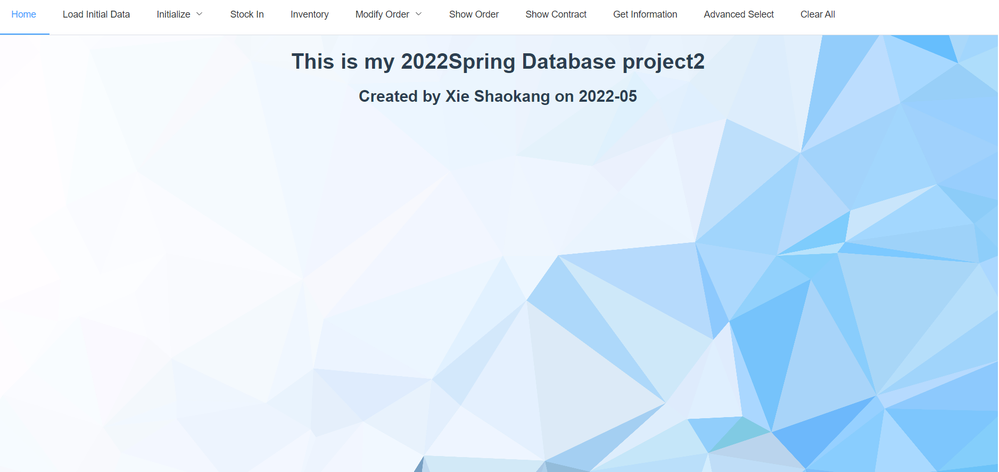
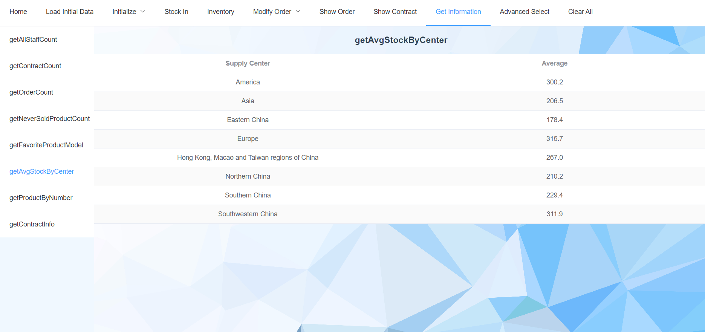
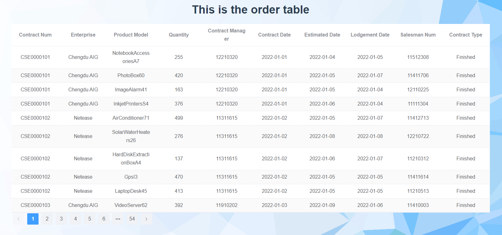
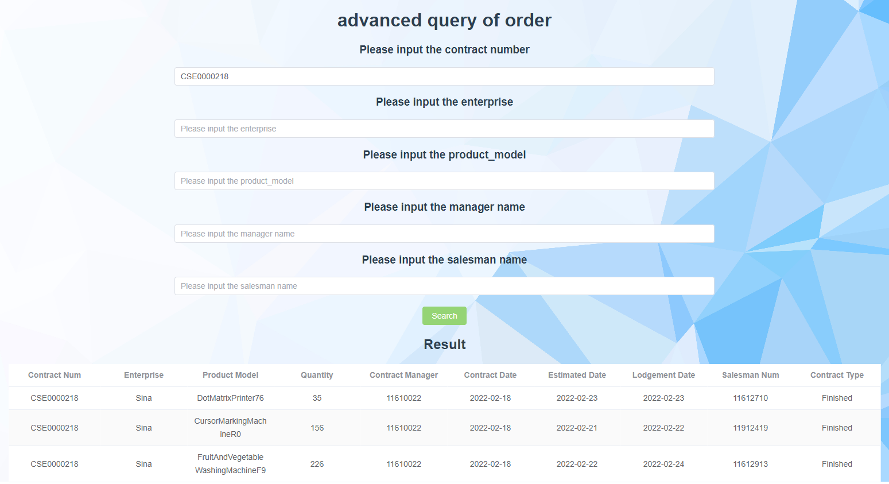

# 2022Spring-Database-Project2

### This is the 2022 Spring Database Project2

- **Created by Xie Shaokang  Yang Yixuan**


- **Using Spring boot with mybatics-plus and Vue**
- **For some data loading and presenting**


### How to build

- Make sure you have install spring boot and vue.

- For **db_project** folder, it is a spring boot project. We first run it on *localhost://8081*.
- For **db_project_vue** folder, it is a vue project. Using ```npm run serve``` to run it on *localhost://8080*.


#### Home Scene 



- At the top of the site, using element ui, we design a menu to implement the operation of loading or present data.


#### Some example pages






